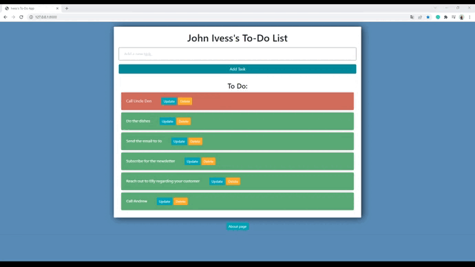

# django-todo-app
### A small to-do list application made by [Ivan "John Ivess" Shyika](https://www.youtube.com/c/JohnIvess).

## Functionality:
- Adding tasks
- Updating task status and title
- Removing tasks

_*You can see more demo materials in [publicity/](publicity/) directory_

---
**Used tools**: Django, Python.
